**Proyecto : Plataforma de análisis de datos en tiempo real**

El propósito es desarrollar una plataforma para la extracción y análisis de datos en tiempo real utilizando APIs, pandas, y Dask, con optimización para procesamiento paralelo y exposición de los resultados.

Por ende, en este caso se va trabajar el clima, que es de la ciudad de Lima. Ya que esto, juega un papel crucial en la vida diaria de las personas, especialmente en ciudades como Lima, donde las condiciones meteorológicas pueden tener un impacto significativo en diversas actividades económicas, sociales y personales. A pesar de la importancia de contar con información climática precisa y actualizada, muchas veces esta información no está fácilmente disponible o no se presenta de manera accesible para el público general.

En respuesta a esta necesidad, nace la idea de desarrollar una **Plataforma de Análisis de Datos en Tiempo Real**. Esta plataforma tiene como objetivo proporcionar a los usuarios datos meteorológicos en tiempo real, análisis detallados y predicciones fiables, todo presentado a través de una interfaz intuitiva y accesible.

Mediante la integración de tecnologías avanzadas de obtención de datos, procesamiento en tiempo real y visualización interactiva, esta plataforma busca convertirse en una herramienta esencial para ciudadanos, investigadores y autoridades. Desde agricultores que necesitan conocer las condiciones de humedad y precipitación, hasta turistas que desean planificar sus actividades diarias, todos se beneficiarán de una fuente confiable de información climática.

Además, al ofrecer un sistema de alertas personalizables, la plataforma ayudará a la comunidad a prepararse mejor para eventos climáticos extremos, contribuyendo así a la seguridad y el bienestar general. Con un enfoque en la precisión, la accesibilidad y la relevancia de los datos, esta iniciativa promete revolucionar la manera en que los habitantes de Lima interactúan con la información climática y toman decisiones informadas basadas en ella. Asimismo en lo siguiente se va desarrollar los tres sprint, de acuerdo a este proyecto.

**Sprint 1: Extracción de datos en tiempo real utilizando APIs y procesamiento inicial**

API significa "Application Programming Interface" (Interfaz de Programación de Aplicaciones). Una API es una interfaz que permite la interacción entre diferentes sistemas de software, facilitando la integración y el intercambio de datos. Las APIs son fundamentales en el desarrollo de software moderno, permitiendo la creación de aplicaciones complejas y la integración de servicios de manera eficiente.

**Objetivos:**

- Configurar la extracción de datos en tiempo real desde diversas APIs.
- Realizar el procesamiento inicial de los datos.

**Actividades:**

**Configuración de APIs:**

- **Identificar y seleccionar las APIs de las cuales se extraerán los datos en tiempo real (por ejemplo, Twitter, Weather, Stock Market).**

  En este caso se trabajará con la meteorología (Weather), esto es la ciencia que estudia la atmósfera y los fenómenos que ocurren en ella, especialmente los relacionados con el clima y el tiempo atmosférico. Incluye el análisis de variables como la temperatura, la humedad, la presión atmosférica, el viento, y la precipitación. El objetivo principal de la meteorología es comprender y predecir el tiempo, así como estudiar los patrones climáticos a largo plazo.

  **Propósito:**

- **Predicción del tiempo**: La función más conocida de la meteorología es la predicción del tiempo, que proporciona información sobre las condiciones atmosféricas futuras a corto y medio plazo.
- **Seguridad y Prevención**: Las predicciones meteorológicas son cruciales para alertar sobre eventos climáticos extremos, como tormentas, huracanes, inundaciones, y olas de calor, permitiendo a las autoridades y a la población tomar medidas preventivas.
- **Agricultura**: Los agricultores dependen de las predicciones meteorológicas para planificar la siembra y cosecha, así como para gestionar el riego y proteger los cultivos de condiciones adversas.
- **Aviación y Navegación**: La meteorología es vital para la seguridad de los vuelos y la navegación marítima, proporcionando información sobre turbulencias, vientos, y condiciones climáticas adversas.
- **Salud Pública**: Las condiciones meteorológicas pueden influir en la salud pública, por ejemplo, las olas de calor pueden aumentar el riesgo de enfermedades relacionadas con el calor, y la calidad del aire puede verse afectada por fenómenos meteorológicos.
- **Energía**: La meteorología también es importante para la gestión de recursos energéticos, especialmente en la generación de energía solar y eólica, que dependen de las condiciones atmosféricas.

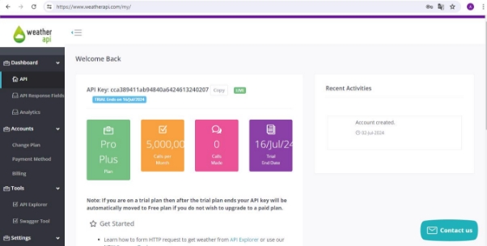

- **Obtener las credenciales necesarias y configurar la autenticación para cada API.**

  **APIs de Meteorología**

  Las APIs de meteorología proporcionan datos meteorológicos en tiempo real y previsiones. Son herramientas útiles para desarrolladores y empresas que necesitan integrar información del clima en sus aplicaciones y servicios. Aquí hay algunas de las APIs más utilizadas:

- **OpenWeatherMap API**: Proporciona datos del tiempo actuales, pronósticos y datos históricos.
- **WeatherAPI**: Ofrece información meteorológica detallada y alertas climáticas.
- **Weatherbit API**: Permite acceder a datos meteorológicos en tiempo real y previsiones.

Estas APIs son utilizadas en diversas aplicaciones, desde plataformas de análisis de datos hasta aplicaciones móviles de previsión del tiempo, sistemas de gestión de riesgos, y más.

**Integración de APIs**

Estas APIs permiten a los desarrolladores y empresas integrar información del clima en sus aplicaciones y servicios, mejorando la precisión y relevancia de la información proporcionada a los usuarios.

**Extracción de datos:**

- **Desarrollar scripts en Python para realizar peticiones a las APIs y extraer los datos en tiempo real.**

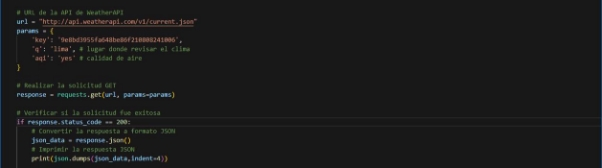

- **Configurar la frecuencia de extracción según la naturaleza de los datos y la capacidad de la API.**

  **Procesamiento inicial de datos:**

- **Limpiar y transformar los datos obtenidos para su análisis posterior.**
- **Estructurar los datos en DataFrames de pandas para un manejo más sencillo. Entregables:**
- **Scripts de extracción de datos desde las APIs.**

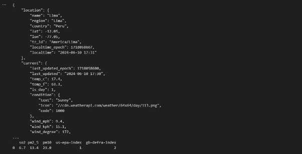

- **Código para el procesamiento inicial de los datos.**

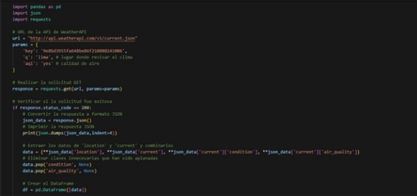

- **DataFrames de pandas con los datos procesados y estructurados.**
1. **Creación del DataFrame**:
- Después de realizar la solicitud GET a la API y obtener la respuesta exitosa (response.status\_code == 200), conviertes la respuesta JSON (json\_data) en un diccionario de Python.
- Luego, combinas los datos de diferentes partes del JSON (json\_data) en un solo diccionario data, eliminando claves innecesarias como 'condition' y 'air\_quality'.
- Finalmente, creas un DataFrame (df) utilizando pd.DataFrame([data]), donde [data] es una lista que contiene el diccionario data.
2. **Uso de pandas**:
- pd.DataFrame([data]): Esta línea convierte el diccionario data en un DataFrame de pandas. Cada clave del diccionario se convierte en el nombre de una columna y los valores asociados se convierten en los datos de esa columna.
3. **Mostrar el DataFrame**:
- print(df): Imprime el DataFrame creado, mostrando así los datos estructurados de manera tabular.

Por lo tanto se utiliza pandas (import pandas as pd) para crear un DataFrame (df) con

los datos procesados y estructurados obtenidos de la API de WeatherAPI. Esto facilita el análisis posterior y la manipulación de los datos meteorológicos de Lima que has solicitado.

**Sprint 2: Implementación de un sistema de análisis en tiempo real utilizando Pandas y Dask**

**Objetivos:**

- **Implementar un sistema de análisis de datos en tiempo real.**
- **Utilizar pandas y Dask para manejar y analizar los datos de manera eficiente.**

**Pandas** y **Dask** son dos herramientas clave en el ámbito del análisis de datos, cada una con sus propias características y aplicaciones:

**Pandas**

**Pandas** es una biblioteca de Python especializada en manipulación y análisis de datos estructurados. Utiliza estructuras de datos como DataFrames, que permiten almacenar y operar con datos tabulares de manera eficiente.

- **Funcionalidad:** Permite cargar datos desde diferentes fuentes (archivos CSV, bases de datos, etc.) y realizar operaciones como filtrado, limpieza, transformación y análisis estadístico.
- **Uso:** Es ideal para conjuntos de datos que caben en la memoria de una sola máquina (escala de gigabytes).

**Dask**

**Dask** es una biblioteca de Python diseñada para escalabilidad y paralelización de operaciones en datos que no caben en la memoria de una sola máquina.

- **Funcionalidad:** Proporciona estructuras de datos (como DataFrames y Arrays) que permiten trabajar con conjuntos de datos más grandes que la memoria RAM disponible, distribuyendo las operaciones en múltiples procesadores o nodos de un clúster.
- **Uso:** Es útil para el procesamiento de grandes volúmenes de datos en entornos distribuidos, facilitando operaciones complejas como el procesamiento paralelo, el cálculo distribuido y el análisis de big data.

Es decir, mientras que Pandas es excelente para análisis de datos tradicional en Python, Dask extiende esta capacidad hacia escenarios donde se requiere procesamiento paralelo y distribuido en grandes volúmenes de datos.

**Actividades:**

**Desarrollo del sistema de análisis:**

- **Implementar funciones de análisis utilizando pandas para realizar operaciones estadísticas y detección de patrones.**
- **Desarrollar un pipeline que procese y analice los datos en tiempo real conforme se reciben. Integración con Dask:**
- **Migrar el procesamiento de datos a Dask para manejar volúmenes grandes de datos de manera paralela y distribuida.**
- **Configurar un clúster local de Dask para distribuir las tareas de análisis. Visualización de resultados:**
- **Desarrollar un dashboard interactivo para visualizar los resultados del análisis en tiempo real (por ejemplo, utilizando Dash o Streamlit).**

  Para este trabajo se utilizó **Streamlit**

  **Entregables:**

- **Código del sistema de análisis en tiempo real utilizando pandas y Dask.**

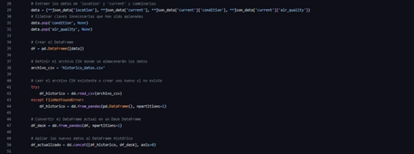

- **Resultados del análisis en forma de resúmenes estadísticos y detección de patrones.**
- **Dashboard interactivo para visualizar los resultados en tiempo real. Link de Streamlit:** <https://jzv93kwv2reldofabrhjs3.streamlit.app/>

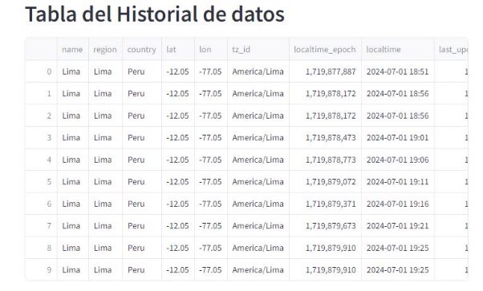

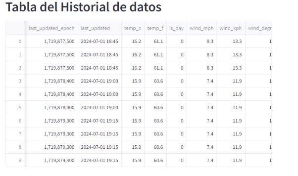

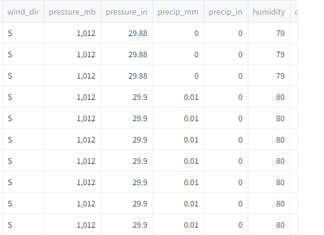

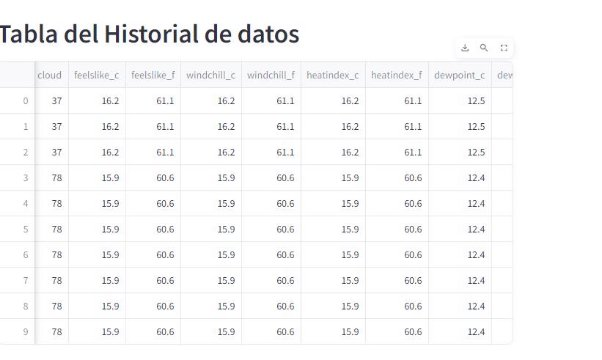

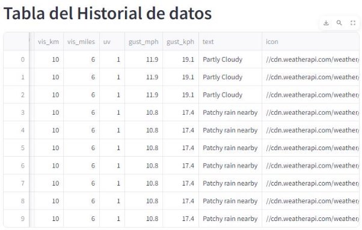

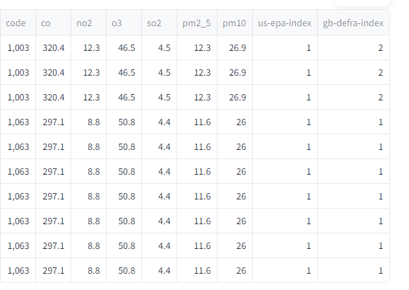

**Sprint 3: Optimización del sistema para procesamiento paralelo y exposición de los resultados**

**Objetivos:**

- **Optimizar el sistema para procesamiento paralelo y en tiempo real.**
- **Preparar y presentar los resultados del proyecto.**

**Analisis y evaluacion:**

En este trabajo se han realizado la mayoría de los objetivos del Sprint. Asimismo para desarrollar una plataforma de análisis de datos en tiempo real del clima en la ciudad de Lima, puedes considerar los siguientes aspectos clave para análisis y evaluación:

1. **Recopilación de Datos en Tiempo Real**:
   1. Utiliza fuentes confiables de datos meteorológicos en tiempo real para Lima. Esto puede incluir estaciones meteorológicas locales, datos satelitales, o información proporcionada por servicios meteorológicos oficiales.
1. **Procesamiento y Normalización de Datos**:
   1. Implementa un pipeline de datos para capturar, limpiar y normalizar los datos meteorológicos. Asegúrate de que los datos estén en un formato estructurado y listos para el análisis.
1. **Análisis de Datos Meteorológicos**:
- Aplica técnicas de análisis estadístico para entender patrones climáticos históricos y actuales en Lima. Esto puede incluir análisis de tendencias, variabilidad estacional, correlaciones entre variables meteorológicas, etc.
4. **Visualización de Datos**:
   1. Desarrolla visualizaciones interactivas que permitan a los usuarios explorar y entender los datos meteorológicos en tiempo real y a lo largo del tiempo. Gráficos como series temporales, mapas de calor, gráficos de dispersión geoespaciales pueden ser útiles.
4. **Predicción y Modelado**:
- Considera la integración de modelos de predicción meteorológica para ofrecer pronósticos a corto y largo plazo. Esto puede incluir modelos basados en machine learning, redes neuronales, o métodos estadísticos tradicionales.

Al implementar estos elementos, podrás desarrollar una plataforma efectiva para el análisis en tiempo real del clima en Lima, proporcionando información valiosa tanto para el público en general como para profesionales en sectores que dependen de datos meteorológicos precisos.

**Conclusión:**

1. **Acceso a Datos Actualizados**: Proporciona a los usuarios acceso inmediato a información climática actualizada, lo cual es crucial para la planificación y toma de decisiones en diversas áreas como agricultura, turismo, transporte y gestión de emergencias.
1. **Predicción**: En este caso, realizar predicciones a corto plazo con mayor precisión. Esto es fundamental para anticipar cambios climáticos bruscos y tomar medidas preventivas.
1. **Aplicaciones Específicas**: Permite el desarrollo de aplicaciones específicas, como alertas meteorológicas personalizadas, pronósticos para actividades al aire libre, análisis de impacto climático en la salud, entre otros, adaptadas a las necesidades locales de Lima.
1. **Visualización y Accesibilidad**: La visualización clara y accesible de los datos climáticos en tiempo real facilita su comprensión por parte de los usuarios finales, incluyendo tanto a ciudadanos como a profesionales en sectores clave.

En resumen, una plataforma de análisis de datos en tiempo real del clima para Lima no solo proporciona información vital en tiempo real, sino que también promueve la resiliencia climática y la eficiencia en la gestión urbana y rural, contribuyendo así al desarrollo sostenible y a la preparación ante eventos climáticos extremos.

**Mejoras para el futuro:**

El proyecto no solo se realizaría para la ciudad de Lima sino para todo el Perú, asimismo para otros paises, por que esto es muy importante en nuestra vida cotidiana.Este proyecto se mejoraría con los siguiente:

**Alertas y Notificaciones**:

- Implementa sistemas de alerta automatizados basados en condiciones meteorológicas críticas o cambios inesperados en el clima de Lima. Esto puede ayudar a usuarios y autoridades a tomar decisiones informadas y oportunas.

**Optimización y Mejora Continua**:

- Evalúa regularmente el rendimiento de la plataforma, la precisión de los datos y la satisfacción del usuario. Utiliza retroalimentación para optimizar los algoritmos de análisis y mejorar la experiencia general del usuario.

**Seguridad y Fiabilidad**:

- Asegúrate de que la plataforma sea segura y cumpla con los estándares de privacidad de datos. Implementa medidas para garantizar la integridad y disponibilidad continua de los datos meteorológicos.
